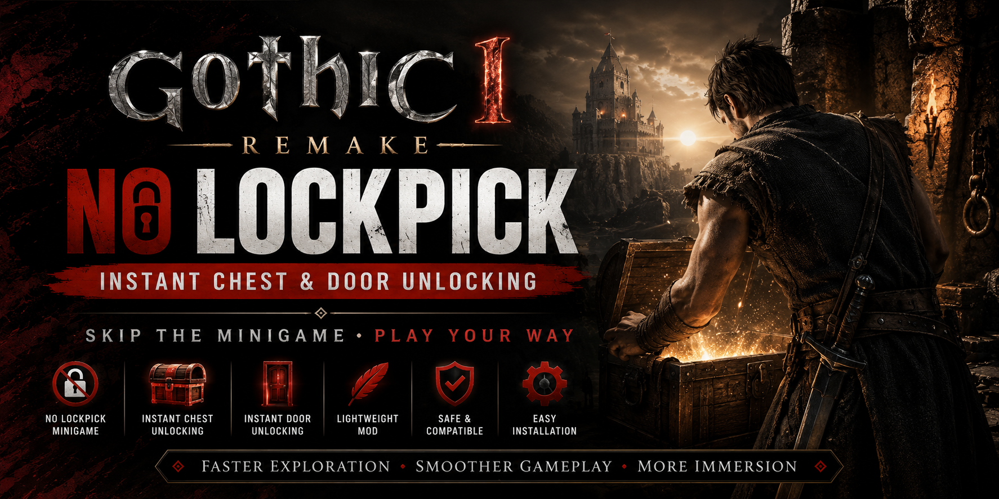
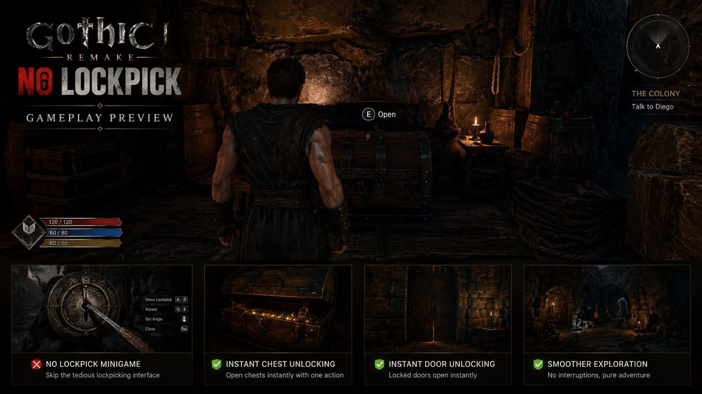
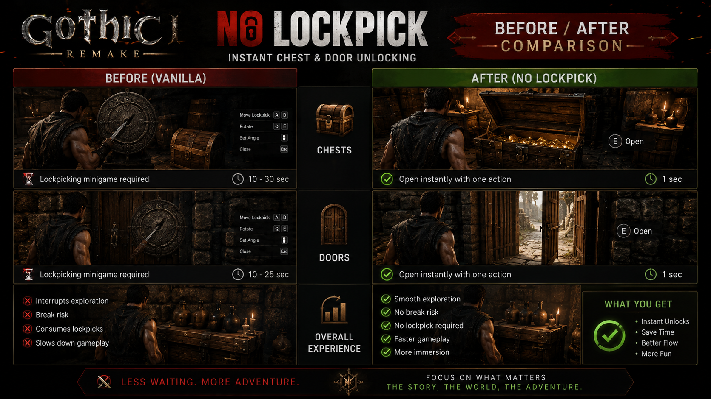

# Gothic-1-Remake-Unlock-All-Chests
Skip the lockpicking minigame in Gothic 1 Remake. Instantly unlock chests and doors for a smoother gameplay experience

# Gothic-1-Remake-No-Lockpick

Skip the lockpicking minigame in Gothic 1 Remake and instantly unlock chests and doors for a smoother gameplay experience.

<div align="center">




# 🔓 Gothic 1 Remake — No Lockpick

### Skip The Minigame • Instant Unlocking • Faster Exploration

[](../../releases/latest)

</div>

---

## 🎯 What Is This?

No Lockpick is a quality-of-life mod for Gothic 1 Remake that removes the lockpicking minigame and allows players to instantly open locked chests and doors.

Perfect for players who want:

* Faster exploration
* Less repetitive gameplay
* Smoother progression
* More focus on quests and combat

---

## ✨ Features

* 🔓 Instant Chest Unlocking
* 🚪 Instant Door Unlocking
* ⚡ Skip Lockpick Minigame
* 🎮 Lightweight Modification
* 🪶 No Performance Impact
* 🔄 Easy Installation
* ✅ Compatible With Current Game Version

---

## 📸 Gameplay Preview



---

## 🔄 Before / After



### Comparison

| Vanilla Game               | No Lockpick        |
| -------------------------- | ------------------ |
| Lockpick Minigame Required | Instant Unlock     |
| Repeated Attempts          | One Action         |
| Exploration Interruptions  | Smooth Exploration |
| Time Consuming             | Faster Gameplay    |

---

## 📥 Installation

1. Download the latest release.
2. Extract the archive.
3. Run:

```txt
Gothic1Remake_NoLockpick_Setup.exe
```

4. Follow the installation instructions.
5. Launch the game.

---

## 🛠️ How It Works

```txt
1. Find a locked chest or door
2. Interact normally
3. The object opens instantly
4. Continue exploring
```

No additional configuration required.

---

## 📊 Benefits

### Exploration

* Faster dungeon runs
* Faster looting
* Less downtime

### Gameplay

* Reduced repetition
* Better pacing
* More immersive adventure

### Convenience

* Simple installation
* Lightweight design
* Easy to use

---

## ❓ Frequently Asked Questions

<details>
<summary><b>Does this affect performance?</b></summary>

No measurable performance impact.

</details>

<details>
<summary><b>Does it change save files?</b></summary>

No.

</details>

<details>
<summary><b>Can I uninstall it?</b></summary>

Yes.

</details>

<details>
<summary><b>Does it work with existing saves?</b></summary>

Yes.

</details>

---

## 🗺️ Roadmap

* [x] Initial Release
* [x] Instant Chest Unlocking
* [x] Instant Door Unlocking
* [ ] Additional Quality Of Life Options
* [ ] Expanded Compatibility Testing

---

## 🤝 Feedback

Found an issue?

Please open an Issue and include:

* Game Version
* Description
* Screenshot (if applicable)

---

## ⭐ Support The Project

If this mod improved your Gothic 1 Remake experience, consider leaving a star.

---

## 📄 License

MIT License

See the LICENSE file for details.

---

<div align="center">

gothic 1 remake mod • no lockpick • unlock all chests • unlock all doors • gothic remake qol mod • instant chest unlock • quality of life mod • gothic 1 remake gameplay improvement
gothic remake lockpicking •  gothic remake lockpick  • gothic remake schlösser knacken  • gothic 1 remake mud •  gothic remake caine  • gothic 1 remake lockpick  • gothic remake kody
gothic remake torrez  •	gothic remake scatty chest • gothic remake otwieranie zamków • gothic remake lockpicking guide  • gothic remake poradnik  • gothic remake otwieranie zamkow 	

</div>
